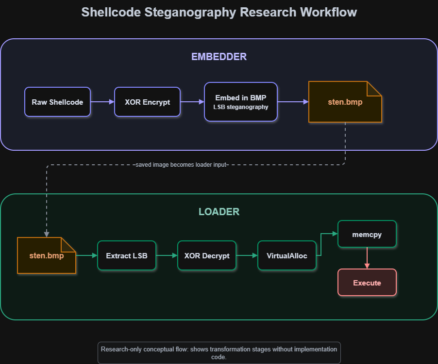

# Steganography Shellcode Loader

This project demonstrates that a payload can be hidden inside a BMP file. 
I made this after completing the first few modules on Maldev Academy. The 
`.rsrc` section module, where they show how payloads can be stored in PE 
resources, kind of reminded me of my college CTF days where flags used to 
be hidden inside image metadata. I did some research and realized I could 
write a payload directly into a `.bmp` file. I am pretty sure this can be 
done with any image format but for this project I focused on bitmap images.

## How It Works
### High Level Flow

