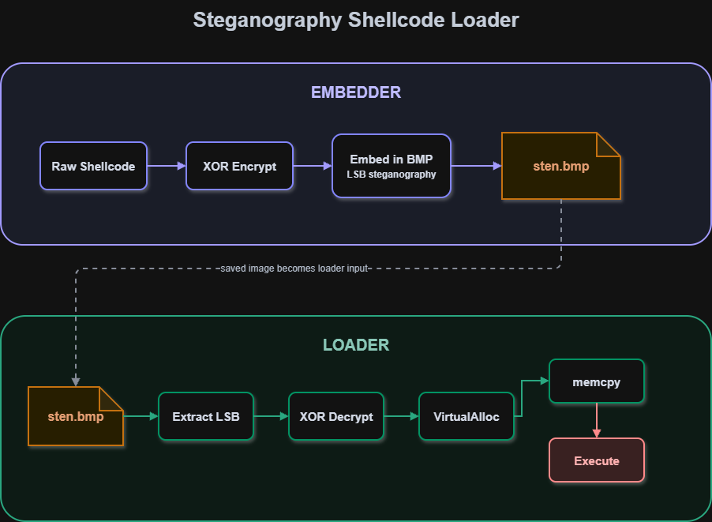
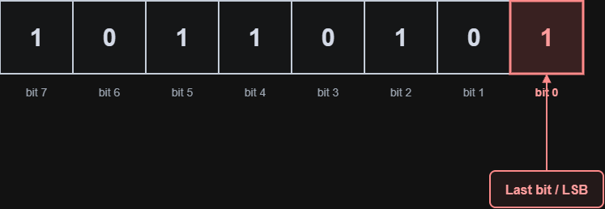
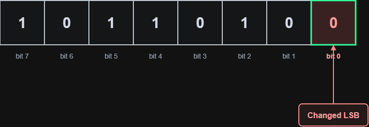
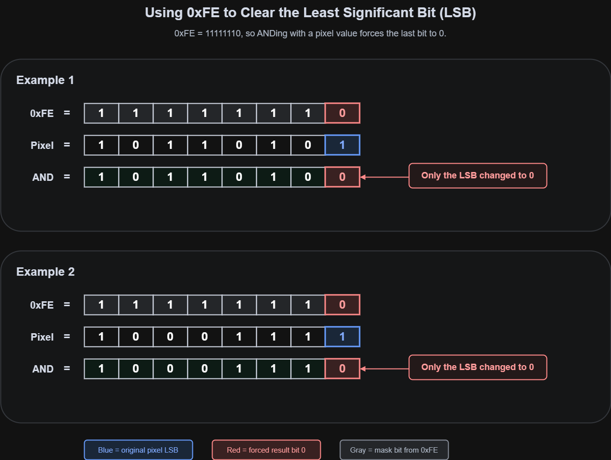
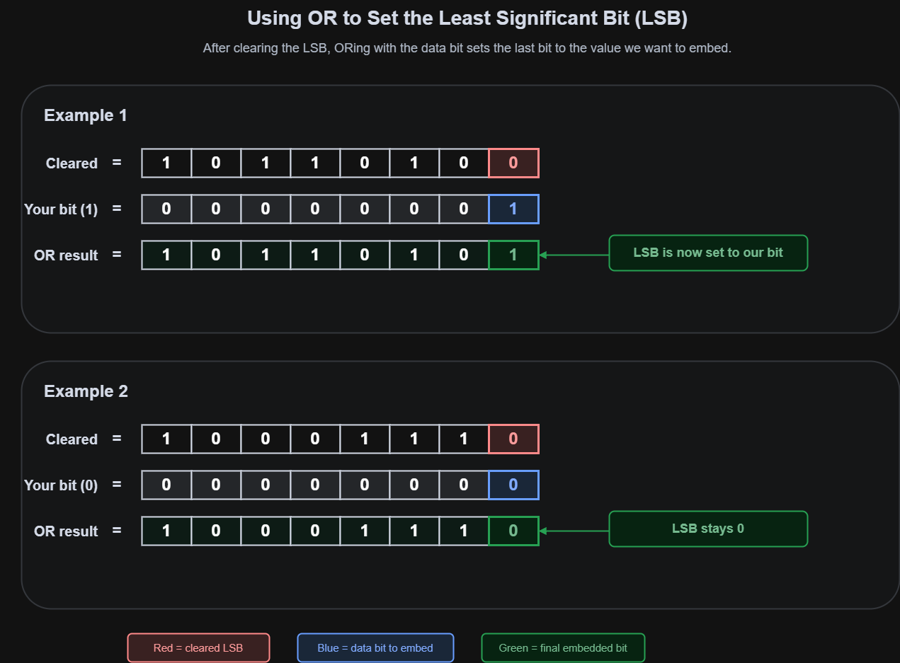
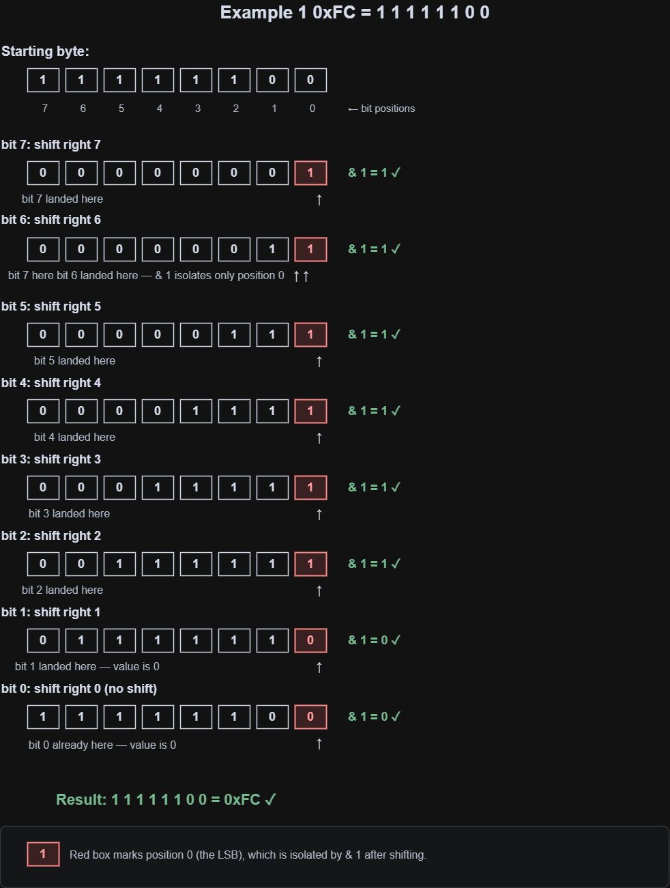
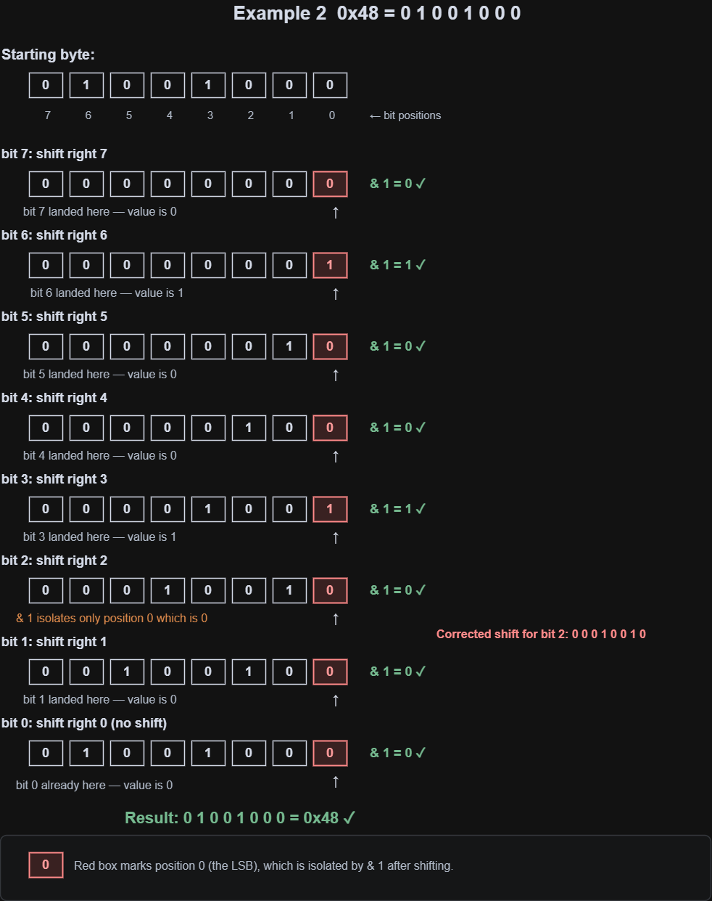
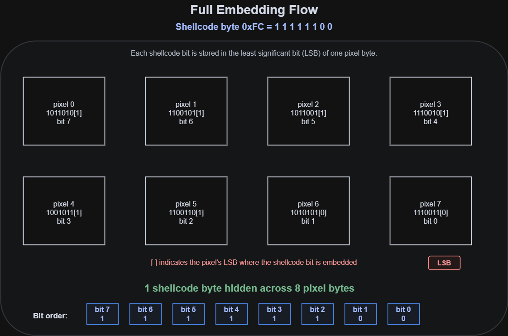

# Steganography Shellcode Loader

This project demonstrates that a payload can be hidden inside a BMP file. 
I made this after completing the first few modules on Maldev Academy. The 
`.rsrc` section module, where they show how payloads can be stored in PE 
resources, kind of reminded me of my college CTF days where flags used to 
be hidden inside image metadata. I did some research and realized I could 
write a payload directly into a `.bmp` file. I am pretty sure this can be 
done with any image format but for this project I focused on bitmap images.

## How It Works


## XOR Encryption
XOR encryption is pretty straightforward. The same function both encrypts 
and decrypts the shellcode applying XOR twice with the same key restores 
it to the original value. In our case the key is `0xBD`. The key can be 
changed but I just stuck with `0xBD` due to its nature which will make more 
sense as we go further. Also possibly try to avoid using `0xFE` as your key 
since that is what is used to clear the LSB (Least Significant Bit) during 
the embedding process.

## BMP File
A BMP file has 3 sections but we only care about the third one which is the 
Pixel Data. The three sections are the File Header, DIB Header, and Pixel Data.

Reference: https://engineering.purdue.edu/ece264/16au/hw/HW13

At some point in the code you will see me reference the pixel data offset 
from the header. The reason for that is the pixel data offset is stored at 
byte 10 in the File Header. So at byte 10 it basically says "hey, the pixel 
data starts at byte 54" and the code jumps straight there. Check the snippet 
below. 
```c
DWORD dwPixelOffset = *(DWORD*)(pBmpBuffer + 10);
// dwPixelOffset = 54
```
##LSB Stenography
Now this is the fun part. LSB steganography hides data inside the Least 
Significant Bit of each pixel byte. Remember a pixel byte is made up of 
8 bits so changing the very last bit makes a difference that is completely 
invisible to the human eye. So let's say we have a pixel byte like this:



We can change the Least Significant Bit from 1 to 0 and there will be no 
visual change to the image whatsoever.



## Embedding One Bit
Remember why I highly discouraged using `0xFE` as your key earlier it is 
because we are going to use it to clear the LSB so we can set it to 0.

You might be wondering why we cannot just replace the LSB directly with 
something like:

```c
lsb[i] = 1
```

That will not work because there is no way to directly access and replace a 
single bit like that in C. So we are going to have to do a little bit of 
binary operations using AND and OR gates. Should have paid more attention in 
my computer architecture class but I did not — spent a lot of time figuring 
this out.

So the first step is to clear the LSB by setting it to 0 and we can do that 
using an AND operation. `0xFE` which is the equivalent of `1 1 1 1 1 1 1 0` 
will keep our entire pixel byte intact and only change the LSB to 0. Might 
seem confusing but here is the breakdown:

0xFE  = 1 1 1 1 1 1 1 0
Pixel = 1 0 1 1 0 1 0 1
AND   = 1 0 1 1 0 1 0 0  ← only the LSB changed to 0

Example 2:
0xFE  = 1 1 1 1 1 1 1 0
Pixel = 1 0 0 0 1 1 1 1
AND   = 1 0 0 0 1 1 1 0  ← only the LSB changed to 0



As you can see in both examples every bit stays exactly the same except the 
LSB which always gets forced to 0. That is the whole point of `0xFE` it 
is a mask that surgically clears only the last bit and nothing else.

Once the bit is cleared we can then set our LSB to our data bit using OR:

Example 1:
Cleared:      1 0 1 1 0 1 0 0  ← LSB cleared to 0
Your bit (1): 0 0 0 0 0 0 0 1  ← data bit we want to embed (1)
OR result:    1 0 1 1 0 1 0 1  ← LSB is now set to our bit

Example 2:
Cleared:      1 0 0 0 1 1 1 0  ← LSB cleared to 0
Your bit (0): 0 0 0 0 0 0 0 0  ← data bit we want to embed (0)
OR result:    1 0 0 0 1 1 1 0  ← LSB stays 0



As you can see when our bit is 1 the OR sets the LSB to 1. When our 
bit is 0 the LSB stays 0. Everything else in the pixel byte remains 
completely untouched.

## Capacity Calculation
A common issue you might run into is your shellcode being too large to fit 
into the BMP. Each pixel byte of the image holds 1 bit of our shellcode and 
each byte of shellcode needs a total of 8 bits. So 1 byte of shellcode takes 
up 8 pixel bytes.

For our 276 byte shellcode:

276 bytes × 8 bits = 2208 pixel bytes minimum

So your BMP needs at least 2208 pixel bytes available after the header for 
the shellcode to fit. The bigger the image the more space you have.

##Extracting the bit
Like I said before there is no way to directly access a single bit like 
`byte.bit[7]`  it simply does not exist in C. So in this scenario we are 
going to use what is called bit shifting. Bit shifting moves the target bit 
into the last position where it can then be isolated using `& 1`.

Think of it like the sliding window algorithm
https://www.geeksforgeeks.org/dsa/window-sliding-technique/

You slide all the bits to the right until the target bit lands at position 0 
which is the very last position. Then you mask everything else out with `& 1` 
which is `0 0 0 0 0 0 0 1` keeping only the last bit and wiping everything 
else out.

AND works here because anything ANDed with 1 keeps its exact bit value and 
anything ANDed with 0 gets wiped:
1 AND 1 = 1  ← kept
0 AND 1 = 0  ← kept
1 AND 0 = 0  ← wiped
0 AND 0 = 0  ← wiped

So now we are going to take the first two bytes of the shellcode `0xFC` and 
`0x48` and walk through the bit shifting process. It should look something 
like this:





Notice how shifting right by 7 pushes bit 7 all the way to position 0 
where we can read it. Shifting right by 6 pushes bit 6 to position 0 
and so on. The `& 1` then wipes out all the leftover bits that came 
along for the ride leaving only the bit we wanted.

0xFC and 0x48 are the first two bytes of our calc shellcode so these 
are the exact bytes going through this process during embedding.

Without bit shifting there is no way to break a byte down into individual 
bits. And without individual bits you cannot embed one bit at a time into 
pixel LSBs. The whole steganography technique depends on this being possible.

## Reassembling Bits Back Into a Byte
During extraction each bit is placed back into its correct position 
using left shift and OR. This is similar to what is above but just a left shitf and OR

Start:         bReassembled = 0 0 0 0 0 0 0 0
bit 7 = 1:     1 << 7 = 1 0 0 0 0 0 0 0
OR result  1 0 0 0 0 0 0 0
bit 6 = 1:     1 << 6 = 0 1 0 0 0 0 0 0
OR result  1 1 0 0 0 0 0 0
bit 5 = 1:     1 << 5 = 0 0 1 0 0 0 0 0
OR result  1 1 1 0 0 0 0 0
... continues until ...
Final:         1 1 1 1 1 1 0 0 = 0xFC 

## Full Embedding Flow


## Project Structure

\```
stenloader/
├── enc.c        ← embedder (XOR encrypt + LSB embed into BMP)
├── readrun.c    ← loader (extract + decrypt + execute)
├── snail.bmp    ← original BMP
└── sten.bmp     ← output BMP with hidden payload
\```

## Disclaimer

This is a learning project built in an isolated VM lab environment.
The code is rough and comments are written for personal reference.
Do not expect clean code.

This project was built strictly for educational purposes to understand 
how steganography and payload obfuscation techniques work at a low level.
This code should not be used for any malicious or illegal activity. If 
you are using this for anything other than learning in a controlled lab 
environment that is on you not me.
